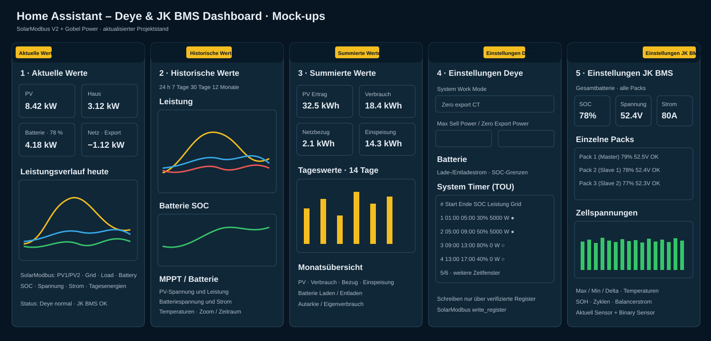

# Home Assistant Deye & JK-BMS Dashboard

SolarAssistant-inspired Home Assistant dashboard for a Deye Hybrid inverter and JK-BMS battery systems.

## Dashboard mock-ups

The current design target is shown below. The mock-ups are based on the verified SolarModbus V2 entity set and the currently available Gobel Power JK-BMS sensors. Values shown are illustrative.

### The five views

1. **Aktuelle Werte** – live energy flow, PV, load, grid and battery values plus today's power history.
2. **Historische Werte** – historical power, SOC, battery voltage/current, MPPT and temperature charts with selectable periods.
3. **Summierte Werte** – daily/monthly PV production, consumption, grid import/export and battery energy.
4. **Einstellungen Deye** – Deye controls based on verified SolarModbus registers, including operating mode and System Timer / TOU. Register writes must be validated for the exact inverter model before use.
5. **Einstellungen JK BMS** – Gobel Power aggregate battery values, individual master/slave packs, cell voltages, temperatures, SOH, cycles, balance current and status information. The current integration exposes sensor and binary-sensor platforms; writable BMS controls will only be added if they are actually supported.

## Data sources

- **Deye:** Home Assistant SolarModbus V2 integration, with direct USB-to-RS485 operation as a target configuration.
- **JK BMS:** Gobel Power Home Assistant integration. Multi-pack systems (master + slaves) are represented individually as well as through aggregate battery-bank values.

## Design

The UI follows the information density and workflow of SolarAssistant while remaining a Home Assistant Lovelace dashboard. The target is a responsive desktop/tablet layout that remains usable on mobile devices.

## Verified implementation principles

- Production YAML must not contain guessed entity IDs.
- Deye controls are only added for verified SolarModbus registers/entities.
- Read-only values must never be presented as writable controls.
- JK-BMS controls are only added when the Gobel Power integration actually exposes a corresponding writable Home Assistant entity/service.
- Multi-pack JK-BMS installations should show both aggregate bank values and each discovered pack.

## Project files

- [`dashboard.yaml`](dashboard.yaml) – current Lovelace dashboard implementation
- [`docs/DASHBOARD_SPEC.md`](docs/DASHBOARD_SPEC.md) – functional specification of all five views
- [`docs/ENTITY_MAPPING.md`](docs/ENTITY_MAPPING.md) – verified entity/register mapping
- [`docs/images/dashboard-mockups.svg`](docs/images/dashboard-mockups.svg) – current visual mock-up

## Status

Entity mapping and dashboard implementation are in progress. The next focus is completing the Deye System Timer / TOU mapping, refining the SolarAssistant-inspired layout and mapping the dynamically generated Gobel Power pack entities.