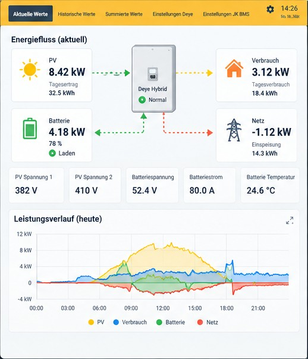
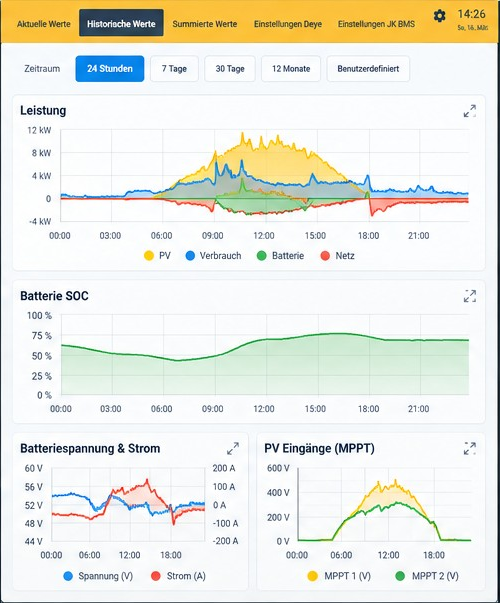
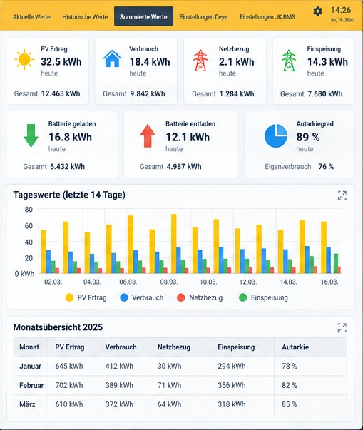
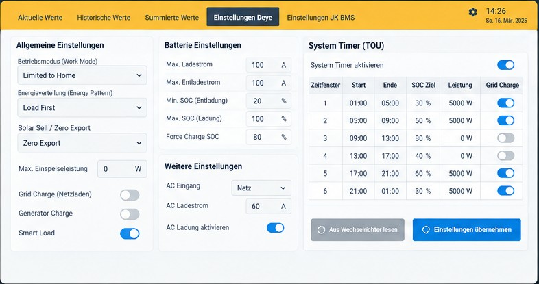
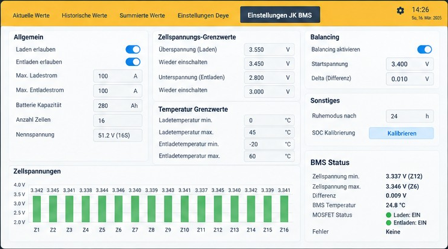

# Home Assistant Deye & JK-BMS Dashboard

SolarAssistant-inspired Home Assistant dashboard for a Deye Hybrid inverter and JK-BMS battery system.

The dashboard is designed for **SolarModbus V2** on the Deye side and the **Gobel Power Home Assistant integration** for JK-BMS battery packs. The target configuration includes direct USB-to-RS485 communication and support for multi-pack JK-BMS systems (master + slaves).

## Installation

### 1. Install the required integrations

#### Deye inverter – SolarModbus V2

Project: https://github.com/comdif/ha-solarmodbus

SolarModbus provides local Modbus communication with Deye hybrid inverters. It supports direct Modbus RTU through a USB-to-RS485 adapter as well as Modbus TCP / RS485 gateways. The project also provides read/write functionality for supported Deye registers.

Follow the installation and configuration instructions in the SolarModbus repository. After installation, add/configure the integration in Home Assistant and verify that the Deye entities are available before importing this dashboard.

#### JK BMS – Gobel Power Home Assistant Integration

Project: https://github.com/fancyui/Gobel-Battery-HA-Integration

The native Gobel Power integration supports JK BMS (55AA protocol) and can communicate through RS485-USB as well as network converters. It supports parallel battery systems by connecting to the master BMS and exposing aggregate values plus individual pack devices.

Recommended installation is through HACS as a custom integration. After downloading it, restart Home Assistant and add **Gobel Battery Monitor** under **Settings → Devices & services → Add integration**. For JK BMS, select the appropriate JK BMS type and Serial/USB or network connection.

For a parallel JK-BMS installation, connect Home Assistant to the master BMS. The integration can discover the associated slave packs.

### 2. Verify the entities

Before installing the dashboard, open **Developer Tools → States** in Home Assistant and verify that both integrations are delivering data.

The final dashboard mapping must use the entity IDs actually generated on your Home Assistant installation. See [`docs/ENTITY_MAPPING.md`](docs/ENTITY_MAPPING.md) for the verified mapping used by this project.

### 3. Install the dashboard

1. Open **Settings → Dashboards** in Home Assistant and create a new dashboard.
2. Open the new dashboard and choose **Edit dashboard**.
3. Open the three-dot menu and select **Raw configuration editor**.
4. Copy the contents of [`dashboard.yaml`](dashboard.yaml) into the raw editor.
5. Save the configuration.
6. If your generated entity IDs differ from the reference names, adjust them according to [`docs/ENTITY_MAPPING.md`](docs/ENTITY_MAPPING.md).

The dashboard contains five views: **Aktuelle Werte**, **Historische Werte**, **Summierte Werte**, **Einstellungen Deye** and **Einstellungen JK BMS**.

> **Important:** Do not write inverter registers until the exact Deye model and register mapping have been verified. Incorrect Modbus writes can change inverter operating parameters. The project only intends to expose controls that have been verified as writable for the configured inverter.

## Dashboard mock-ups

The following five mock-ups define the current visual target. Values shown in the images are illustrative; the production dashboard will only use verified Home Assistant entities and writable parameters.

### 1. Aktuelle Werte

Live energy flow, PV production, house consumption, grid import/export, battery status and today's power history.

### 2. Historische Werte

Historical power, battery SOC, battery voltage/current and MPPT charts with selectable time periods.

### 3. Summierte Werte

Daily and monthly PV production, consumption, grid import/export, battery energy, self-sufficiency and self-consumption.

### 4. Einstellungen Deye

Deye operating parameters and System Timer / TOU. Controls will only be implemented for verified writable SolarModbus entities/registers and must match the inverter model.

### 5. Einstellungen JK BMS

Aggregate battery-bank data, master/slave packs, cell voltages, temperatures, SOH, balancing and BMS status. Writable controls will only be added where the Gobel Power integration actually exposes them.

## Implementation principles

- No guessed entity IDs in production YAML.
- Deye controls only for verified SolarModbus registers/entities.
- Read-only values are never presented as writable controls.
- JK-BMS controls only where Gobel Power exposes a corresponding writable Home Assistant entity/service.
- Multi-pack installations show both aggregate battery-bank values and each discovered pack.
- The layout should remain usable on desktop, tablet and mobile devices.

## Project files

- [`dashboard.yaml`](dashboard.yaml) – Lovelace dashboard implementation
- [`docs/DASHBOARD_SPEC.md`](docs/DASHBOARD_SPEC.md) – functional specification of the five views
- [`docs/ENTITY_MAPPING.md`](docs/ENTITY_MAPPING.md) – verified entity/register mapping
- [`docs/images/mockups/`](docs/images/mockups/) – individual visual mock-ups

## Status

Entity mapping and dashboard implementation are in progress. Current priorities are completing the Deye System Timer / TOU mapping, matching the Lovelace layout to these mock-ups and mapping the dynamically generated Gobel Power pack entities.