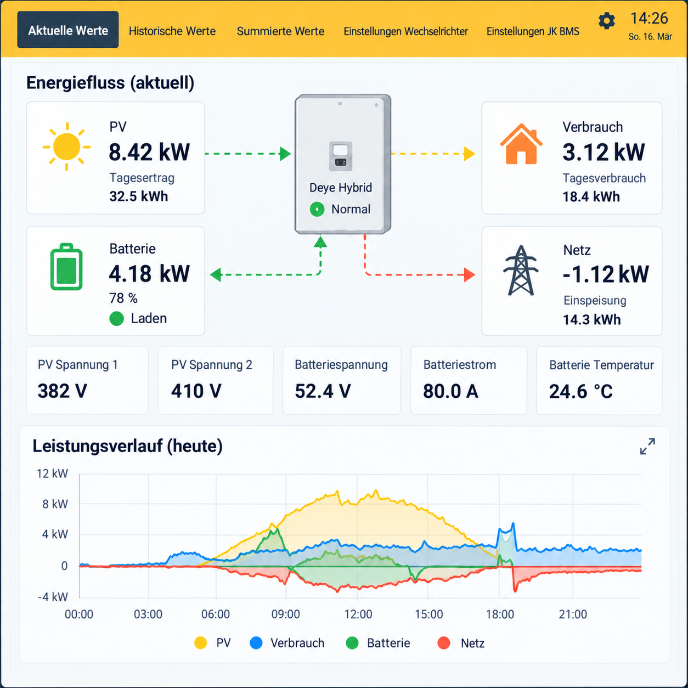
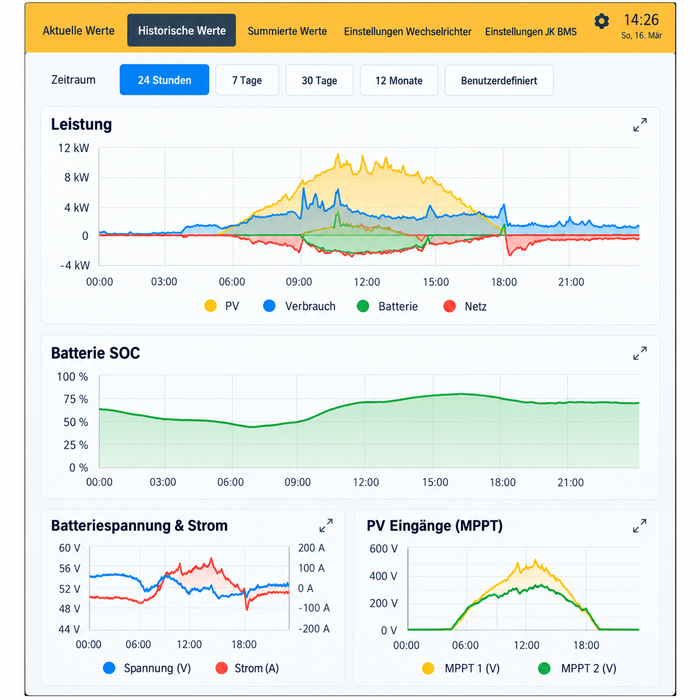
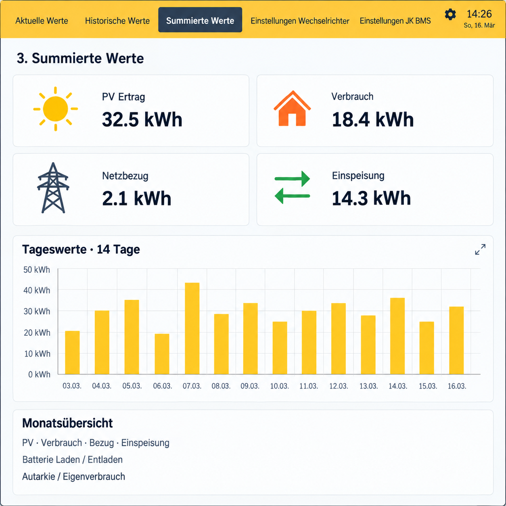
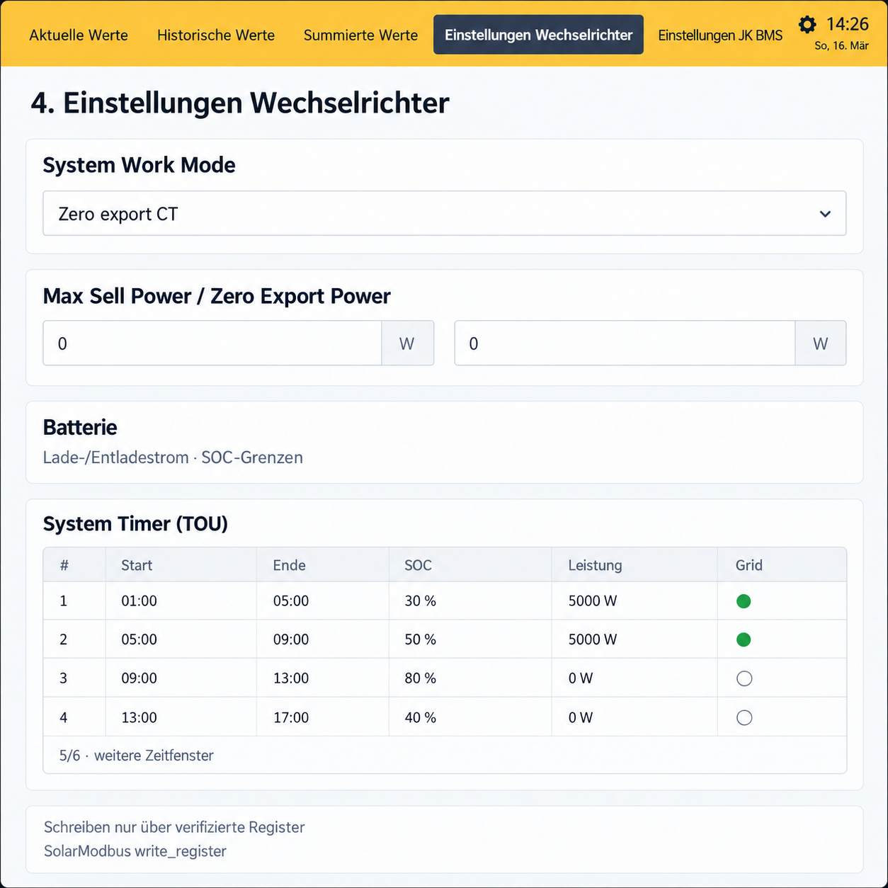
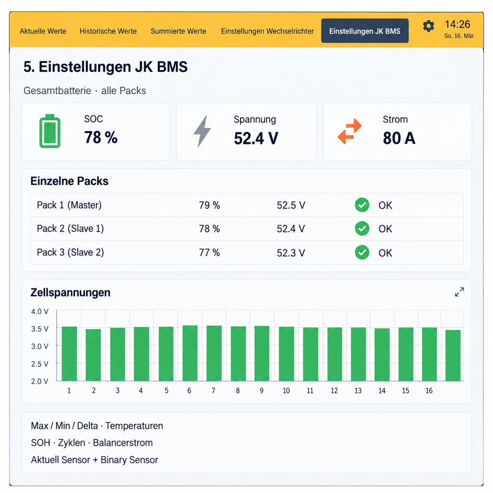

# Home Assistant Multi-Inverter & JK-BMS Dashboard

SolarAssistant-inspired Home Assistant dashboard for PV systems with **one to three inverters** and an optional **JK-BMS battery system**.

The dashboard UI is deliberately manufacturer-neutral. Inverter slots 1–3 can be assigned to **Deye, Solis, Hoymiles or other inverter integrations** as long as the required Home Assistant entities are mapped. Mixed systems are supported conceptually, for example Deye + Solis or Solis + Hoymiles.

The existing Deye/SolarModbus V2 mapping remains the verified reference profile for inverter 1. Other manufacturers are not assigned guessed entity IDs; their actual Home Assistant entity IDs must be mapped from the integration used on the target installation.

## Supported layout

- 1, 2 or 3 inverters
- same or mixed inverter manufacturers
- PV/MPPT values per inverter where available
- inverter status and AC power
- combined battery, grid and load values
- JK-BMS master/slave battery systems via Gobel Power
- manufacturer-specific settings only when the integration exposes verified writable entities/services

## Installation and updates via HACS

The project now contains a real Home Assistant custom integration. HACS installs the integration into `custom_components/pv_battery_dashboard` and can manage later updates.

### 1. Open this repository directly in HACS

If the button is not used, add this repository manually in **HACS → ⋮ → Custom repositories**:

- Repository: `https://github.com/alexseuf/home-assistant-deye-jkbms-dashboard`
- Type: **Integration**

Then choose **Download** in HACS and restart Home Assistant.

### 2. Add the integration

After the restart, use this button:

Or open **Settings → Devices & services → Add integration** and search for **PV & Battery Dashboard**.

During setup, leave **Dashboard bei Start automatisch aktualisieren** enabled if the HACS version should manage the dashboard automatically.

The integration creates a Lovelace **storage dashboard** named **PV & Batteries** with URL path `pv-battery-dashboard`. No change to `configuration.yaml`, no package file and no Raw configuration editor are required.

### 3. Install the inverter integration

For the current example profile install **Solis Modbus by Pho3niX90**:

https://github.com/Pho3niX90/solis_modbus

The bundled dashboard in version **0.1.1** is mapped to the verified Solis S5-EH1P entity IDs from the target Home Assistant installation and to the verified Gobel/JK-BMS aggregate plus pack 00–02 entities. The generic mapping model remains documented for other installations.

Other inverter profiles remain possible through the mapping model in [`docs/ENTITY_MAPPING.md`](docs/ENTITY_MAPPING.md).

### Verified 0.1.1 target profile

Version **0.1.1** uses the actual entity IDs exported from the target Home Assistant instance on 2026-09-27. It removes non-existent Solis TOU controls from the dashboard and adds the real three-pack Gobel/JK-BMS data.

### Updating

Releases are published with version tags, matching the update model used by `tigo-tap-local`.

1. HACS detects a newer GitHub release.
2. Home Assistant exposes the HACS repository as an available update under **Settings → Updates**.
3. Confirm the update there; HACS downloads and installs the new integration version.
4. If Home Assistant requests a restart, confirm the restart from the update flow.
5. With automatic dashboard updates enabled, the managed dashboard is replaced by the bundled dashboard during startup.

A manual fallback remains available under **Settings → Devices & services → PV & Battery Dashboard → Entities → Dashboard aktualisieren**.

> The dashboard created by this integration is managed content. Manual edits to that specific dashboard can be overwritten by the next automatic dashboard update.

### Manual / legacy installation

The previous YAML/package method remains documented in [`docs/INSTALLATION_HOME_ASSISTANT.md`](docs/INSTALLATION_HOME_ASSISTANT.md) for users who do not want HACS.

The dashboard contains five views:

1. **Aktuelle Werte**
2. **Historische Werte**
3. **Summierte Werte**
4. **Einstellungen Wechselrichter**
5. **Einstellungen JK BMS**

> **Important:** Writable inverter functions are manufacturer-, integration- and model-specific. Never reuse Deye Modbus register writes for Solis, Hoymiles or another inverter. Only expose controls after the exact writable entity/service/register has been verified for that inverter.

## Multi-inverter concept

The dashboard distinguishes between the visual function and the source integration.

For every inverter slot, map as many of these logical functions as the device provides:

- inverter AC power
- operating status
- PV/MPPT power
- PV/MPPT voltage/current
- daily PV yield
- grid/load values if the inverter is the system source for them
- battery values if the inverter is the system source for them
- optional writable settings

Not every inverter has to expose every function. A Hoymiles microinverter, for example, can be used primarily as an additional PV producer while a hybrid inverter provides battery and grid values.

## Dashboard mock-ups

The following five mock-ups are the original visual reference used before today's graphics changes.

### 1. Aktuelle Werte

### 2. Historische Werte

### 3. Summierte Werte

### 4. Einstellungen Wechselrichter

### 5. Einstellungen JK BMS

## Implementation principles

- UI labels are manufacturer-neutral.
- Up to three inverter slots are supported.
- Different inverter manufacturers may be combined.
- No guessed manufacturer entity IDs in production YAML.
- Deye/SolarModbus V2 and Solis Modbus by Pho3niX90 are verified reference profiles.
- Writable controls are only added for verified entities/services/registers of the exact inverter model.
- Read-only values are never presented as writable controls.
- JK-BMS controls are only added where Gobel Power exposes a corresponding writable Home Assistant entity/service.
- Multi-pack battery installations show aggregate values plus discovered packs.
- Layout should remain usable on desktop, tablet and mobile.
- HACS integration installs and updates the managed Lovelace dashboard without editing `configuration.yaml`.

## Project files

- [`dashboard.yaml`](dashboard.yaml) – Lovelace dashboard
- [`docs/DASHBOARD_SPEC.md`](docs/DASHBOARD_SPEC.md) – functional specification
- [`docs/ENTITY_MAPPING.md`](docs/ENTITY_MAPPING.md) – inverter/BMS mapping model and verified reference entities
- [`docs/images/mockups/`](docs/images/mockups/) – visual references
- [`docs/INSTALLATION_HOME_ASSISTANT.md`](docs/INSTALLATION_HOME_ASSISTANT.md) – installation in Home Assistant
- [`custom_components/pv_battery_dashboard/`](custom_components/pv_battery_dashboard/) – HACS custom integration
- [`hacs.json`](hacs.json) – HACS repository metadata
- [`home-assistant/configuration-snippet.yaml`](home-assistant/configuration-snippet.yaml) – legacy YAML dashboard registration
- [`home-assistant/packages/solis_dashboard_helpers.yaml`](home-assistant/packages/solis_dashboard_helpers.yaml) – optional legacy Utility Meter helpers

## Status

The dashboard is manufacturer-neutral and supports up to three inverter slots. The repository is now structured as a **HACS custom integration**. Its config flow creates and manages a Lovelace storage dashboard automatically; HACS handles integration updates, and the dashboard can be refreshed automatically after restart or manually with the provided Home Assistant button. The bundled reference profile currently uses **Solis Modbus by Pho3niX90**.

## Quality checks

GitHub Actions automatically validates the project:

- **HACS validation** for repository/integration structure
- **hassfest** for Home Assistant manifests, config flow and translations
- **Python compile check** with `compileall`
- **literal \\n guard** to catch accidental escaped newlines outside strings/comments
- **daily scheduled validation** in addition to push/pull-request checks

The release workflow mirrors the protection used in `alexseuf/tigo-tap-local`:

- validates that the release/tag version matches `manifest.json`
- recompiles all integration Python files
- repeats the literal-newline guard
- builds `pv_battery_dashboard.zip`
- creates a GitHub prerelease with generated release notes
